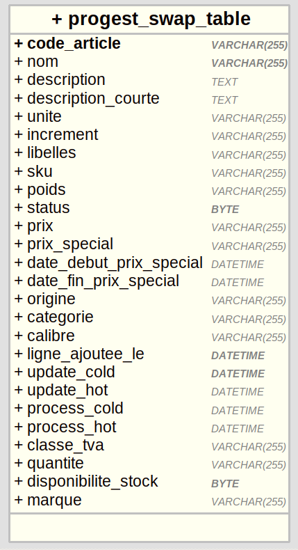

# Bio&Co click&collect - projet Boeki

Date de création: March 4, 2022 5:33 PM
Dernière modification: March 8, 2022 9:53 AM
Statut: Terminé
Type: Spec produit

# Informations document

| Auteur | j.standbridge@boeki.fr |
| --- | --- |
| Organisation | Agence Boeki |
| Date | 4 mars 2022 |
| Version | 1.0.0 |

# Présentation du flux Progest → Magento 2

## Table des matières

## Problématique

Des exports sous format XML des données du catalogue produit de Bio&Co sont réalisés périodiquement et déposé sur un dépôt SFTP.

Ces fichiers doivent être utilisés afin d’hydrater la base catalogue du futur site e-commerce Magento2 à destination du click&collect de Bio&Co.

## Architecture retenue

Le flux se réalise en deux temps :

- **Création de la table swap :** un script nommé **progest_swap_script** parcours via un client SFTP les derniers fichiers XML déposés par le flux Progest, et insère les données dans une table swap créé pour l’occasion de la base SQL du site Magento 2. Grâce à un système de renseignement de date de mise à jour et de création, il est possible d’identifier dans la table les nouveaux produits, les produits dont les données froides ont été mise à jour et les produits dont les données chaudes ont été mise à jour.
    
    Ce script gère l’archivage et la délétion des fichiers dépôts directement sur le dépot SFTP
    
- **Scrapping des données de la table swap et création/update des produits sur le site** : un module Magento 2 nommé **Progest_Products** développé pour l’occasion permet de récupérer les données de la table hydratée par le précédent script et de créer / mettre à jour des produits au besoin.
    
    Un système de log permet le suivi des actions et erreurs intervenues lors de chaque exécutions du module.
    

## Script PHP progest_swap_script

### Présentation

**Informations :**

| Version | 1.0.0 |
| --- | --- |
| Auteur | james.standbridge.git@gmail.com |
| Github (privé) | ‣ |
| Organisation | Agence Boeki |
| Répertoire | {{site}}/var/boeki/progest_swap_script/main.php |

**composer.json**

```json
{
    "name": "boeki/pogest_swap_script",
    "type": "project",
    "require": {
        "php": ">7.3",
        "symfony/var-dumper": "5.4.x-dev",
        "simplon/mysql": "dev-master",
        "jamesstandbridge/simple-php-sftp": "dev-main"
    },
    "require-dev": {
        "php": ">7.3"
    },
    "autoload": {
        "psr-4": {
            "Boeki\\PogestSwapScript\\": "src/"
        }
    },
    "authors": [
        {
            "name": "jamesstandbridge",
            "email": "james.standbridge.git@gmail.com"
        }
    ],
    "minimum-stability": "dev"
}
```

**Modèle relationnel de la table progest_swap_product**



MCD table progest_swap_product

### Fonctionnement

**Exécution** 

```bash
$ php progest_swap_script/main.php {{code_mag}} {{base_de_données}} {{contexte}}
```

**Contextes**

- **COLD :** exécute le script dans le contexte de récupération des données froides quotidienne. Le script récupère le dernier fichier XML de données froides ***articles_JARCNT.xml*** du dépôt et compare ces informations avec les produits présents dans la table swap via la colonne **code_article.** Si le code n’existe pas, une nouvelle ligne est insérée.
    
    Si le code existe déjà, les informations sont comparées et modifiées si nécessaire. Si une modification au minimum a lieu, alors la colonne **update_cold** est actualisé avec la date et heure courante.
    
    ***colonnes traitées :** "nom", "description", "description_courte", "marque", "unite", "increment", "libelles", "sku", "poids", "status", "classe_tva”*
    
- **HOT_FULL :** exécute le script dans le contexte de récupération des données chaudes quotidienne. Le script récupère le dernier fichier XML de données chaudes full ***artstock_fullday_{{date}}.xml*** du dépôt et compare ces informations avec les produits présents dans la table swap via la colonne **code_article**. Si le code n’existe pas, la ligne est ignorée.
    
    Si le code existe, les informations sont comparées et modifiées si nécessaire. Si une modification au minimum a lieu, alors la colonne **update_hot** est actualisé avec la date et heure courante.
    
    ***colonnes traitées :** "prix", "quantite", "origine", "categorie", "calibre”*
    
- **HOT_FLY :** exécute le script dans le contexte de récupération des données chaudes une fois par heure entre 7h et 19h dans la journée depuis le fichier ***artstock_fly_{{date}}.xml .*** Le procédé est le même que pour le contexte **HOT_FULL**.

- **HOT_INIT :** cette exécution n’est pas utilisé dans les CRONS et permettra uniquement d’initialiser les données chaudes des produits lors de la mise en production du projet, suivant le même procédé que les deux précédents contextes.

**planification des crons**

Chaque site Magento 2 du click&collect disposera de sa propre instance de script et donc d’un cron distinct des autres.

Dépôts des fichiers :

- **articles_JARCNT.xml :** tous les jours entre **4h00 et 4h05** du matin
- **artstock_fullday_{{date}}.xml :** tous les jours entre **4h00 et 4h05** du matin
- **artstock_fly_{{date}}.xml : toutes les heures** à minute 01 environ, de **7h à 19h** dans la journée. (7h01, 8h01, etc)

cron : 

- **COLD :** tous les jours à **4h10**

```bash
10 4 * * * #“At 04:10.”
```

- **HOT_FULL :** tous les jours à **5h**

```bash
0 5 * * * #“At 05:00.”
```

- **HOT_FLY :** toutes les heures entre 7h et 19h à minute 10. (7h10, 8h10, etc)

```bash
10 7-19 * * * #“At minute 10 past every hour from 7 through 19.”
```

vitesse d’exécution estimée

- **COLD :** environs 150 produits par seconde
- **HOT_FULL :** environs 100 produits par seconde
- **HOT_FLY :** environs 100 produits par seconde

**Archivage** 

dossier cible : /**archive** du dépôt progest.

nettoyage : conserve les **189 fichiers derniers fichiers**.

Etant donné qu’une multitude de cron simulaires mais pour des sites différents doivent s’exécutés sur un même fichier, la méthode d’archivage est particulière. 

Il est obligatoire de déplacer un fichier seulement lorsque tous les sites ont eu l’occasion de le traiter.

Ainsi, voici le fonctionnement pour chacun des fichiers

- **articles_JARCNT.xml :** archivé lors de la prochaine exécution du script dans le contexte **HOT_FULL.** Le nom du fichier est modifié afin d’y ajouté la date et heure.
- **artstock_fullday_{{date}}.xml :** archivé lors de la prochaine exécution du script dans le contexte **HOT_FLY**.
- **artstock_fly_{{date}}.xml :** archivé lors de la prochaine exécution du script dans le contexte **COLD.**

## Module Magento 2 Boeki/Progest_Product

### Présentation

**Informations**

| Version | v1.0.0 |
| --- | --- |
| Auteur | james.standbridge.git@gmail.com |
| Github |  |
| Organisation | Agence Boeki |
| Répertoire | {{code}}/app/code/Progest/Products/Cron/Products.php |

**composer.json**

```json
{
    "name": "progest/module-products",
    "description": "Magento 2 module Products by Progest.",
    "type": "magento2-module",
    "version": "1.0.0",
    "authors": [
        {
            "name": "James Standbridge",
            "email": "james.standbridge.git@gmail.com",
            "role": "Full-stack Developer"
        }
    ],
    "require": {
        "php": "7.x"
    },
    "minimum-stability": "stable",
    "prefer-stable": false,
    "autoload": {
        "files": [
            "registration.php"
        ],
        "psr-4": {
            "Progest\\Products\\": ""
        }
    }
}
```

**crontab.xml**

```xml
<?xml version="1.0"?>
<!--
/**
 * Copyright © Boeki.
 * This file has been generated by the Boeki Module Core - CLI Commands Manager
 *
 * @author    Boeki (https://boeki.fr/)
 * @copyright Boeki
 * 
 */
-->
<config xmlns:xsi="http://www.w3.org/2001/XMLSchema-instance" xsi:noNamespaceSchemaLocation="urn:magento:module:Magento_Cron:etc/crontab.xsd">
  <group id="default">
    <job name="progest_products_products" instance="Progest\Products\Cron\Products" method="execute">
      <schedule>*/30 * * * *</schedule>
    </job>
  </group>
</config>
```

**module.xml**

```xml
<?xml version="1.0"?>
<config xmlns:xsi="http://www.w3.org/2001/XMLSchema-instance" xsi:noNamespaceSchemaLocation="urn:magento:framework:Module/etc/module.xsd">
    <module name="Progest_Products" setup_version="1.0.0">
        <sequence>
            <module name="Magento_Backend"/>
            <module name="Magento_Theme"/>
        </sequence>
    </module> 
</config>
```

### Fonctionnement

**Exécution** via la méthode **execute()** du fichier Progest/Products/Cron/Products.php

**Étapes :**

1. **Création des nouveaux produits** **:** une sélection est effectuée sur la table **progest_swap_product** est exécutée afin de récupérer les nouveaux produits.
    
    Par définition, un nouveau produit est un produit respecte les contraintes suivantes :
    
    - **code_article** non null
    - **update_cold** et **update_hot** non null
    - **process_cold** et **process_hot** doivent être null
    - **status** égal à 1 (web activé)
    
    Chaque ligne produit est ainsi traitée et permet la création des fiches sur le site. Les données froides et chaudes sont hydratées.
    
    Les colonnes **process_cold et process_hot** sont actualisées avec la date courante.
    
2. **Mise à jour des données froides :** une sélection est effectuée sur la table **progest_swap_product** est exécutée afin
    
    Par définition, un tel produit est défini par les contraintes suivantes :
    
    - **update_cold** et **process_cold** non null
    - **update_cold > process_cold**
    
    Chaque ligne produit est ainsi traitée et les champs modifiés du produit correspondant sur le site sont mise à jour. Seules les données froides sont traitées.
    
    La colonne **process_cold** est actualisée avec la date courante.
    
3. **Mise à jour des données chaudes :** une sélection est effectuée sur la table **progest_swap_product** est exécutée afin de récupérer les produits dont une des valeurs chaudes à été mise à jour.
    
    Par définition, un tel produit est défini par les contraintes suivantes :
    
    - **update_cold**, **update_hot**, **process_cold** et **process_hot** non null
    - **update_hot > process_hot**
    
    Chaque ligne produit est ainsi traitée et les champs modifiés du produit correspondant sur le site sont mise à jour. Seules les données chaudes sont traitées.
    
    La colonne **process_hot** est actualisée avec la date courante.
    

**planification du cron**

Chaque site Magento 2 du click&collect disposera de sa propre instance du module et donc d’un cron distinct des autres.

Le cron s’exécutera une fois à 5H30 du matin puis toutes les heures entre 7H et 19 à la mi-heure (7h30, 8h30, etc)

**Journal d’évènements**

Des logs sont rédigés lors de chaque exécution, sur le fichier {{site}}/var/log/progest_log.log

## Mapping des données

| Type | XML Progest | Colonne swap | Code attribut site |
| --- | --- | --- | --- |
| froide | code_article | code_article | sku |
| froide | /article/DG/fiche/libelle | nom | name |
| froide | /article/DG/descriptions/description/description | description | description |
| froide | /article/DG/fiche/libCaisse | description_courte | short_description |
| froide | /article/DG/fiche/marque | marque | bio_marque |
| froide | /article/DG/fiche/objet/caracteristique[@code=”poids_tare” ⇒ unite] | unite | bio_unite |
| froide | /article/DG/fiche/objet/caracteristique[@code=”web_increm”] | increment | bio_increment |
| froide | /article/DG/descriptions/description/description[@type=”LBQ”] | libelles | bio_labels |
| froide | /article/DG/GTIN/code/ | sku | ean_progest |
| froide | /article/DG/caracteristiques/poidsNet | poids | weight |
| froide | /article/DC/centrale/pilotagePV/eCommerce | status | status |
| chaude | /artSite/tarifVente/prixTTC | prix | price |
| froide | /article/DG/taxes/taxe | classe_tva | tax_class_id |
| chaude | /artSite/reappro/stockDispo | quantite | quantity |
| froide | /article/DG/fiche/objet/caracteristique | disponibilite_stock | stock_status |
| chaude | /artSite/producteur | origine | bio_provenance |
| chaude | /artSite/categorie | categorie | progest_categorie |
| chaude | /artSite/calibre | calibre | bio_calibre |